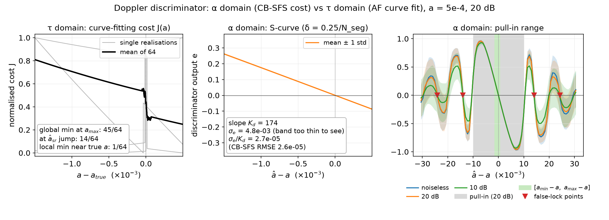

# OCDM Doppler estimation

Clean-room implementation (from scratch, per Ron's request) of the signal
model and estimators behind the AF-magnitude Doppler estimator for OCDM,
and a reproduction of the previous results (22-Jan and 31-Jan 2026
documents), as the baseline for the proposed closed-loop detector.

Sources:
- **[OCDM]** Z. Tan, *OCDM Signal Analysis* — signal model (Sec. 2–3),
  analytical AF (Eqns. 8–12), Section-4 algorithm.
- **[CBSFS]** M. Kumar and R. Dabora, *A Novel Sampling Frequency Offset
  Estimation Algorithm for OFDM Systems Based on Cyclostationary
  Properties*, IEEE Access 7, 2019 — Eqns. (27)–(34).
- *Algorithm Steps & Results*, 22-Jan and 31-Jan 2026 (the results
  documents, "the documents" below).

## Status

| step | what | state |
|---|---|---|
| 1 | infrastructure: signal model, analytical AF, CB-SFS | done |
| 2 | Section-4 curve-fitting estimator + reproduction of the documents' figures and tables | done (see *Step 2 results*) |
| 3 | early-late discriminator S-curve (proof of concept for the loop) | done (see *Step 3 results*) |
| 4 | present reproduction + loop proposal to Ron | next |
| 5 | closed-loop detector | |

## Layout

Package `ocdm_doppler/` (NumPy only):

| module | contents |
|---|---|
| `params.py` | `SystemParams` — one frozen object fully describes an experiment; presets mirror the two results documents |
| `signal_model.py` | OCDM transmitter `X(t)`, single-path Doppler receiver `Y(t)` ([OCDM] Eqn. 3), deterministic block noise |
| `analytical_af.py` | `Pi`, `Theta`, `Gamma`, `c_Y`, `af_magnitude` ([OCDM] Eqns. 8–12) |
| `cbsfs.py` | segmented CAF (27), autocorrelated CAF (28), cost function (29), peak location, Doppler estimate (33)–(34) |
| `af_estimation.py` | documents' Step 2(a)–(b): time selection (Eqn. 1), lag grid, empirical AF, window detection |
| `curve_fit.py` | documents' Step 3: `|A0|^2` and `tau_p0` estimates, MSE curve fit over `N_a` candidate Doppler values |
| `discriminator.py` | early-late discriminator on the CB-SFS cost (29): `predicted_alpha`, `early_late`, `s_curve`; `e > 0` means `a_hat` too small; default `delta = 0.25/N_seg` (selected in Step 3) |

Scripts (run from this directory; need `matplotlib` for the figures):

| script | output |
|---|---|
| `verify_infrastructure.py` | 10 sanity checks (10/10 passing; check 6 = discriminator zero and sign) |
| `make_figures.py` | `figures/*.png` + `figures/figures_log.txt` — every figure of the documents, the curve-fitting cost surface, a [CBSFS] Fig. 5-style plot (~9 min; `--a-sr genie` skips CB-SFS) |
| `mc_curvefit.py` | `results/mc_curvefit.csv` / `.md` — Monte-Carlo NMSE and bias tables of the documents, ours next to theirs; incremental, `--resume` after an interruption |
| `mc_cbsfs_22jan.py` | Monte-Carlo NMSE of CB-SFS alone |
| `study_scurve.py` | Step 3: discriminator S-curves, metrics and the tau-domain contrast → `results/scurve.csv` / `.md` / `_log.txt`, raw costs in `results/scurve_raw/`, `figures/fig_scurve_*.png`; `--quick`, `--resume`, `--max-new` (~27 min compute, 4 processes), `--replot` (tables + figures from the raw data only, seconds) |
| `study_cbsfs_accuracy.py` | CB-SFS sweeps over `M`, `N_seg`, harmonic index (tables below) |

## Design decisions worth knowing

**No resampling.** [OCDM] Eqn. (3) is a closed form for `Y(t)`, so the
receiver is evaluated directly at whatever instants an estimator asks for.
This avoids interpolation error entirely and is faster than generating a
long oversampled waveform.

**The guard interval is a zero gap, not a cyclic prefix.** In [OCDM]
`g(t) = 1` only on `[0, T_is)`, so each OCDM symbol is followed by `T_gi`
of silence. This is what makes `|Y[k]|^2` periodic and gives CB-SFS its
strongest cyclostationary signature.

**Two distinct sampling grids.** AF estimation uses the fine grid `T_s`
(the CT approximation); CB-SFS uses the receiver's nominal rate
`T_samp_ns`. These are kept separate on purpose — quantising the nominal
samples onto the `T_s` grid introduces a spurious rate error of order
`1/rho ≈ 1e-3`, i.e. the same size as the Doppler being measured.

**`cost_function` takes arbitrary cycle frequencies.** Not just a uniform
grid. The planned early-late discriminator evaluates the cost at two
`alpha` values either side of the predicted harmonic, so it can call this
directly and nothing in `cbsfs.py` needs to change.

**Time origin at received symbol K.** The documents average over
`i = -(N_avg-1)/2 .. +(N_avg-1)/2` around `t' = 0`, i.e. they assume the
signal exists at negative times. `af_estimation.make_signal` places the
receiver's time origin at the start of received symbol `K > (N_avg-1)/2`
(`t_origin = K T_sym / (1+a)`), which shifts `(1+a)t - tau_p0` by exactly
`K T_sym`: the within-symbol position, `Gamma` and `|Pi|` are unchanged.
The analytical AF for a *candidate* `a` must be evaluated at the receiver
time `t_sel`, not at `t_origin + t_sel` — the origin shift is exact only
for the true `a` (`WindowedAF.analytical` does this).

**CB-SFS settings for `a_sr`** (not stated in the documents): `N_c = 24000`
samples, `N_seg = 2048`, harmonic 1, window `±0.05 alpha_1` with 128 points,
parabolic refinement. Figures and Monte-Carlo use the same settings.

## Step 2 results: the curve-fitting estimator

The estimator follows the documents exactly (Steps 1–3): `a_sr` from
CB-SFS; `t_sel` by the variance test; `N_lag` lags, window of highest power;
`|A0|^2_hat = 4 sigma_hat^2_Y(t_sel) / sigma_D^2`,
`tau_p0_hat = (t_sel - tau_win_r)(1 + a_sr)`; `N_a = 2^18` candidates in
`(a_min, a_max)`, minimum MSE between the windowed empirical AF and
`|Pi * Gamma|`.

**Monte-Carlo NMSE, 128 trials** (`results/mc_curvefit.md` has the full
tables incl. normalised bias). **Ours** / documents:

| case | SNR (dB) | CB-SFS | `|A0|^2` | `tau_p0` | **Doppler (curve fit)** |
|---|---|---|---|---|---|
| 31-Jan (noiseless, `a_sr = a`) | ∞ | – | – | – | **4.24** / 4.91 (bias −0.84 / −1.01) |
| S1 | 10 | 0.0081 / 0.065 | 0.099 / 0.095 | 0.21 / 0.99 | **0.78** / 1.17 |
| S1 | 20 | 0.0030 / 0.0044 | 0.0020 / 0.0018 | 0.082 / 0.030 | **1.00** / 1.49 |
| S2 (`rho = 2^6`) | 10 | 0.0069 / 0.065 | 0.097 / 0.099 | 0.37 / 1.69 | **0.81** / 1.33 |
| S2 | 20 | 0.0029 / 0.0044 | 0.0020 / 0.0020 | 0.079 / 0.031 | **0.99** / 1.64 |
| S3 (`a_max = 1e-2`) | 10 | 6.4e-5 / 6.5e-4 | 0.097 / 0.098 | 0.38 / 1.85 | **0.84** / 0.60 |
| S3 | 20 | 3.0e-5 / 4.4e-5 | 0.0021 / 0.0018 | 0.036 / 0.033 | **0.27** / 0.57 |
| S4 (`a_max = 1e-2`, `rho = 2^6`) | 10 | 8.6e-5 / 6.5e-4 | 0.099 / 0.098 | 0.23 / 1.51 | **0.89** / 0.58 |
| S4 | 20 | 3.3e-5 / 4.4e-5 | 0.0020 / 0.0019 | 0.034 / 0.105 | **0.29** / 0.49 |
| S5 (`N_is = 64`) | 10 | not run — see *What is missing* | | | |
| S5 | 20 | not run — see *What is missing* | | | |
| dense window (`N_lag = 2^8` in the known window) | 20 | 0.0030 / 0.0071 | 0.0020 / 0.0019 | 7.5e-10 / 9.7e-4 | **2.21** / 4.77 |

The documents' 4096-trial bias run (S1, 20 dB) was not repeated (see
*What is missing*); the 128-trial biases are in `results/mc_curvefit.md`
(S1, 20 dB: Doppler +0.63 vs the documents' +0.67).

**The documents' conclusion is reproduced: the curve-fitting Doppler
estimate is essentially uninformative** (NMSE 0.3–4, vs 1e-2 – 1e-5 for
the CB-SFS estimate it starts from), and a denser lag grid makes it worse.

### Why — three mechanisms

**1. The cost surface is flat and monotone, so the estimate goes to a grid
boundary.** `|Pi|` stretches by `(1+a)`, i.e. the lag axis of the analytical
curve changes by only 0.2 % across the whole range `(a_min, a_max)`
(`1 ± 1e-3`) — comparable to or below the residual
model mismatch of the empirical AF (0.6 % of the peak even noiseless,
finite `N_avg`). The MSE is therefore dominated by that mismatch and is
nearly flat and monotone in `a` (`figures/fig_curvefit_cost.png`: it varies
by ~1–2 % over the range in the noisy runs, ~20 % noiseless, with no
minimum near the true `a`). The sign of the mismatch decides which end
wins: in the 31-Jan run 107 of 128 estimates sit exactly at `a_min` (49)
or `a_max` (58), which is what the documents' numbers imply too (half at
each end gives NMSE = 0.5·3² + 0.5·1² = 5, bias −1). In the 22-Jan runs
most estimates sit at `a_max` (87–107 of 128 for S1–S4, except S3/S4 at
20 dB — see 2).

**2. The window-edge `tau_p0` estimate ties the fit to `a_sr`.** With
`tau_p0_hat = (t_sel - tau_win_r)(1 + a_sr)`, the analytical `Gamma` for the
candidate `a = a_sr` has its upper edge exactly on the last windowed lag:
candidates below `a_sr` drop that lag (`Gamma = 0`), candidates above keep
it. The cost therefore has a jump at `a_sr`, and the minimum is either
there or at a boundary. Where it lands at `a_sr`, the "curve-fit" estimate
is really the CB-SFS estimate — this is why S3/S4 at 20 dB look better
(NMSE ≈ 0.28; only 12–14 of 128 at `a_max`): not information from the AF.

**3. `|A0|^2_hat` carries the noise power.** `sigma_hat^2_Y` includes `P_n`,
so `|A0|^2_hat` is biased by `4 P_n / sigma_D^2` (relative `+0.31` at 10 dB,
`+0.031` at 20 dB) — NMSE 0.098 / 0.0020, matching the documents to ~10 %
in every setting. This scales the analytical curve and adds to the
mismatch in (1).

**Denser lags make it worse** (dense window: Doppler NMSE 2.2 vs 1.0):
`tau_p0` becomes essentially exact, but the additional lags are mostly in
the sidelobes, where the empirical AF has a noise floor
`≈ sigma_D^2 |A0|^2 / (4 sqrt(N_avg))` and the analytical AF has nulls —
more weight on the part of the curve that carries no Doppler information
and the most mismatch (documents p. 3 figure; `fig_22jan_dense_window.png`).

**Where our numbers differ from the documents:** CB-SFS is 1.5–10× more
accurate here (their CB-SFS parameters are not stated; `N_seg` alone moves
the error by orders of magnitude, see below), and at 10 dB our `tau_p0`
NMSE is lower (0.2–0.4 vs 1.0–1.8). The Doppler conclusions do not depend
on either.

### What is missing, and why

Everything in the documents has been reproduced except the following:

| item | status | why | how to complete |
|---|---|---|---|
| **Monte-Carlo, Setting 5** (`N_is = 64`), 10 and 20 dB | **not run** | Four background runs launched from Claude Code were killed by its idle-session low-memory safeguard (the system as a whole ran low on memory; the script uses ~300 MB per process). S5 is ~4× slower per trial than S1–S4 (CB-SFS has 64 lags instead of 16), so one 128-trial S5 case takes ~20–30 min and never finished before a kill. Results are saved per completed case, so nothing else was lost. | `python mc_curvefit.py --resume --cases 22jan --settings 5 --procs 1` in a normal terminal (~40–60 min); it appends to `results/mc_curvefit.csv` and rebuilds the `.md`. |
| **Normalised-bias run, N_mc = 2^12** (S1, 20 dB; documents p. 3) | **skipped (decision)** | ~2.5 h of compute, too long to survive the memory kills above. Our 128-trial biases are already in `results/mc_curvefit.md` and are close to the documents' 4096-trial values for S1, 20 dB (Doppler +0.63 vs +0.67, `|A0|^2` +0.032 vs +0.031; `tau_p0` +0.099 vs +0.093; CB-SFS +0.0032 vs +0.0012). | `python mc_curvefit.py --resume --cases bias` (~2.5 h). |

What *is* available for Setting 5: the single-realisation figure
`figures/fig_22jan_setting5.png` (it matches the documents' broken case:
analytical AF flat at ~0.005, empirical AF noise) and its curve-fit numbers
in `figures/figures_log.txt` (`a_hat_mag` at `a_min` at both SNRs; at
20 dB `tau_p0_hat` = 1.49e-6 vs 0.5e-6 true). A 2-trial smoke test gave
Doppler NMSE 9 and `tau_p0` NMSE 7.8 at 20 dB (documents: 8.48, 19.9) —
consistent with the documents but far too few trials to report.

Not started yet (by plan): Steps 4–5 (proposal to Ron, closed-loop
detector).

## Step 3 results: the early-late discriminator (proof of concept)

**Question.** Does a discriminator in the cycle-frequency domain have what a
tracking loop needs — a zero crossing at the true Doppler, a linear region
with a usable slope, a wide pull-in range, a measurable noise level — where
the curve-fitting cost (Step 2) has none of these? This is evidence for the
*loop proposal*, not a claim that a loop is more accurate than CB-SFS.

**Discriminator** (`ocdm_doppler/discriminator.py`). Predict the harmonic at
`alpha_p = (1 + a_hat) / N_sym` (k = 1), evaluate the CB-SFS cost (29) at
`alpha_p ± delta`, and output `e = (C+ − C−) / (C+ + C−)`. `e > 0` means
`a_hat` is too small, so the loop update is `a_hat += mu e`. Two cost
evaluations per update, versus a grid of 128–512 for CB-SFS.

**Setup** (`study_scurve.py`): 22-Jan preset, N_c = 24000, N_seg = 2048,
harmonic 1; `a_hat − a` over ±3e-2 (dense ±2e-3); `delta` ∈ {0.25, 0.5,
0.75}/N_seg. N_mc = 64 for a = 5e-4 (the main results). The a = 5e-3 runs
use N_mc = 16 and **only check that the S-curve depends on the offset
alone**, not on a. The mean S-curves coincide (`figures/fig_scurve_snr.png`,
right): same K_d (175 vs 174), same pull-in, same stable points. σ_e/K_d
comes out 12–25 % lower at a = 5e-3; with 16 trials a standard deviation is
itself uncertain by ≈ 18 %, so this is at the edge of what the check
resolves (the ratio to CB-SFS on the same data is ≈ 1.0 at both a).
Full tables: `results/scurve.md`.



**Choice of delta.** Fixed before the run: the smallest σ_e/K_d at a = 5e-4,
20 dB, among the deltas whose pull-in range covers `[a_min − a, a_max − a]`.
All three qualify; **δ = 0.25/N_seg** has the best accuracy. Larger δ gives
a steeper slope and a wider pull-in, but the probe points sit lower on the
main lobe where the cost is smaller and relatively noisier, so the noise
grows faster than the slope (`figures/fig_scurve_delta.png`):

| δ·N_seg (a = 5e-4, 20 dB) | K_d | pull-in (≥ 90 % correct sign) | σ_e/K_d |
|---|---|---|---|
| 0.25 | 174 | ±9.9e-3 | **2.7e-5** |
| 0.5 | 369 | ±1.3e-2 | 3.7e-5 |
| 0.75 | 584 | ±1.5e-2 | 1.0e-4 |

**Characteristics at δ = 0.25/N_seg, a = 5e-4, N_mc = 64:**

| SNR | bias (zero crossing) | K_d | linear (R², ±2e-3) | pull-in | σ_e at 0 | **σ_e / K_d** | CB-SFS RMSE, same data | CB-SFS RMSE, Step 2 (128 trials) |
|---|---|---|---|---|---|---|---|---|
| noiseless | +2.6e-6 | 174 | 1.0000 | ±9.9e-3 | 4.4e-3 | **2.5e-5** | 2.4e-5 | – |
| 20 dB | +1.9e-6 | 174 | 1.0000 | ±9.9e-3 | 4.8e-3 | **2.7e-5** | 2.6e-5 | 2.7e-5 |
| 10 dB | +1.5e-6 | 174 | 1.0000 | ±9.9e-3 | 7.9e-3 | **4.6e-5** | 4.3e-5 | 4.5e-5 |

- **Zero crossing at the true Doppler.** The bias (≤ 2.6e-6, < 0.6 % of a) is
  below its own standard error σ_e/(K_d √64) ≈ 3–6e-6: no measurable bias.
- **Linear with a constant slope.** K_d = 174 at every SNR (175 at
  a = 5e-3); the mean S-curve is linear to R² = 1.0000 over ±2e-3, i.e. the
  whole `a_min..a_max` scale.
- **Wide pull-in.** ±9.9e-3 (grid step 7.6e-4 there), i.e. 10× the prior
  range `|a| < 1e-3`, as
  predicted by the main-lobe nulls at ±1/N_seg in α ⇒ ±N_sym/N_seg = ±9.8e-3
  in a.
- **The implied single-block error σ_e/K_d equals the CB-SFS RMSE** on the
  same data (ratio 1.01–1.06) and the Step-2 CB-SFS RMSE — same order, as
  expected: both read the same peak of the same cost function. The noise
  floor at high SNR (noiseless σ_e ≈ 20 dB σ_e) is the self-noise of the
  cyclostationary estimate from a finite record with random data, not
  channel noise.

**False locks.** Beyond the pull-in range the S-curve follows the Dirichlet
sidelobes of the cost function, and a loop (which climbs `C`) can settle on
a sidelobe peak. The mean S-curve has stable zero crossings at
**±1.41e-2 and ±2.41e-2** (every SNR), matching the sidelobe peaks at
±1.5/N_seg and ±2.5/N_seg in α (±1.46e-2, ±2.44e-2 in a). With the prior
`|a| < 1e-3` (22-Jan S1/S2) any initialisation in `[a_min, a_max]` is well
inside the pull-in range. For `a_max = 1e-2` (S3/S4) the prior range is as
wide as the pull-in range, so the loop should be initialised from a CB-SFS
acquisition (or acquire with a smaller N_seg: the pull-in scales as
`N_sym / N_seg`).

**Contrast with the τ domain** (same 64 realisations, a = 5e-4, 20 dB;
`figures/fig_scurve_tau.png`). The curve-fitting cost J(a) (Step 2, N_a =
2^12) has its global minimum at `a_max` in 45, at the `a_sr` window-edge
jump in 14, at `a_min` in 1 and in the interior in 4 of 64 realisations.
Its gradient discriminator `e_tau = −dJ/da` is positive almost everywhere
(J decreases towards `a_max`): only 4 of 64 realisations have any zero
crossing (a local minimum of J) away from the ends and the jump, and only
**1 of 64** has one within 1e-4 of the true a. A gradient-following loop on
the AF-magnitude fit would drift to `a_max`. RMSE of `argmin J`: 4.9e-4,
versus 2.6e-5 for the CB-SFS `a_sr` it starts from.

**What this does *not* show.** No steady-state accuracy advantage over
CB-SFS: on the same block, one discriminator update is exactly as accurate
as the CB-SFS grid search (σ_e/K_d ≈ CB-SFS RMSE), and averaging a loop over
L blocks is equivalent to CB-SFS on an L-times longer record. The loop's
advantages are elsewhere: **tracking a time-varying Doppler** (CB-SFS would
be re-run from scratch on every block) and **cost per update** — 2 cost
evaluations instead of a 128–512-point grid.

**What a loop simulation would add (Step 5, after Ron's feedback, not done
here):** iterate `a_hat_{n+1} = a_hat_n + mu e_n` over consecutive blocks
and measure the convergence time and steady-state jitter versus `mu` (loop
noise bandwidth), the tracking lag for a Doppler ramp, and the
false-lock / cycle-slip probability versus the initial error.

## Step 1 findings (CB-SFS)

**`Delta = 0` must be in the CB-SFS lag set.** Omitting it (using
`Delta = 1..N_is`) destroys the estimator — the cost function becomes
essentially noise. The guard interval makes the instantaneous power
periodic, and that is the dominant cyclostationary feature.

**The `alpha ≈ 0` skirt must be excluded from peak search.** The
stationary component produces a peak at `alpha = 0` roughly 27× taller
than the cycle-frequency peaks; any threshold relative to the global
maximum then rejects the real peaks. The search range starts at
`0.5 * alpha_1`.

**Harmonic-windowed search beats generic peak detection.** Assigning "the
k-th detected local maximum is harmonic k" is fragile: Dirichlet sidelobes
are picked up as separate peaks. `locate_harmonic` searches a window
centred on `k * alpha_1` instead.

**`N_seg` dominates CB-SFS accuracy** (noiseless, M = 1200, harmonic 2):

| `N_seg` | 128 | 256 | 512 | 1024 | 2048 |
|---|---|---|---|---|---|
| rel. error | −275% | −124% | +21% | +6.6% | +1.4% |

**Higher harmonics do *not* give net leverage here.** Measuring harmonic
`k` and dividing by `k` shrinks the error as `1/k`, but the harmonics decay
fast, so the peak-SNR penalty cancels the gain (noiseless, `N_seg = 2048`,
4 seeds):

| `k` | 1 | 2 | 3 | 4 | 5 |
|---|---|---|---|---|---|
| peak height | 3.1e−3 | 1.9e−3 | 8.7e−4 | 2.0e−4 | 6.6e−5 |
| rel. error | 0.7% | 3.4% | 1.3% | 1.3% | 2646% |

`k = 1..4` are usable; `k >= 5` breaks down. **Relevant to the loop
design: the discriminator should sit on the fundamental or the 2nd
harmonic, not a high one.**

## Open questions to raise with Ron

1. **Is the magnitude inside or outside the AF average?** The documents
   write

   ```
   c_hat_Y(t_sel, tau_k) = sum_i | Y(...) Y*(...) | / N_avg
   ```

   with the modulus *inside* the sum. That estimator converges to
   `E{|Y(t)||Y(t-tau)|}`, which is strictly positive and has **no nulls** —
   it cannot match the analytical `|Pi|`, which does. Writing
   `| sum_i Y Y* | / N_avg` (modulus outside) is what converges to `|c_Y|`.

   *Resolved by the figure reproduction:* the published figures match only
   the modulus-**outside** version. In the 31-Jan noiseless figure the
   empirical AF falls to ~0.02 at the edge of the main lobe; modulus-inside
   would stay near 0.32·π/4 ≈ 0.25 there. The noisy sidelobe floor
   (~0.01–0.02) is the finite-`N_avg` residual `≈ 0.32/sqrt(N_avg)`. So the
   document text is most likely a typo. `af_estimation` defaults to
   `"outside"`. To confirm with Ron.

2. **CB-SFS parameters are not stated** in either document — `N_seg`, the
   number of observed symbols `M`, `N_T`, and the cycle-frequency grid
   resolution. As the table above shows, `N_seg` alone moves the error by
   two orders of magnitude. We use the settings under *Design decisions*,
   which give 1.5–10× lower CB-SFS NMSE than the documents report.

3. **Peak refinement.** [CBSFS] searches a grid of `N_seg` points; that
   resolution is far coarser than the Doppler values here, so sub-grid
   parabolic refinement is enabled by default. Was it used originally?

4. **`T_s` reference differs between the documents** — the 22-Jan document
   uses `(1 + a_min)`, the 31-Jan one `(1 + a_true)`. Both are supported
   via `ts_reference`.

5. **Negative time indices.** The averaging sum runs over
   `i = -(N_avg-1)/2 .. +(N_avg-1)/2`, so `t_sel + i * T_sr` goes negative
   for the first half — where no signal exists. *Handled* by the time-origin
   shift (see *Design decisions*); presumably the original simulation had
   symbols at negative times.

6. **`tau_p0` for the 31-Jan experiment.** There the lags span only the
   main lobe, so the detected "window" is the whole lag set and
   `tau_p0_hat` from its edge is undefined. We use the true `tau_p0`
   (`Gamma = 1` on all those lags, so the fit does not depend on it). What
   did the original use?
